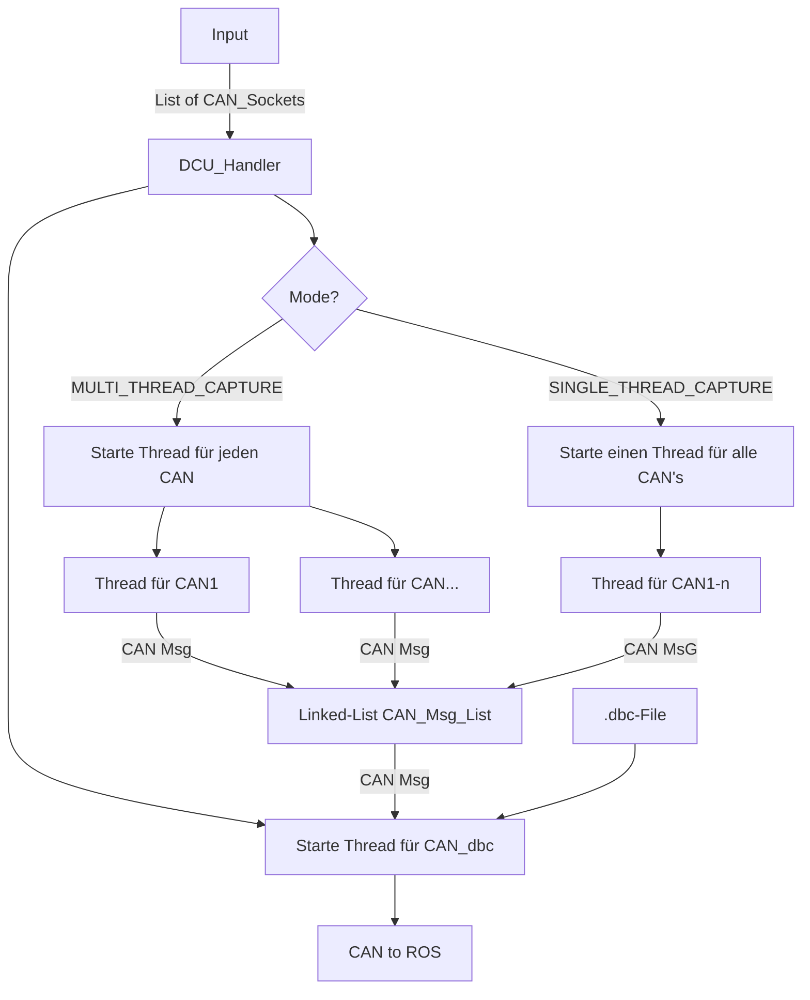

# Setup Repository

```
git submodule add https://github.com/xR3b0rn/dbcppp.git external/dbcppp
```

Wenn 'external/dbcppp/' schon als Submodule vorgemerkt ist bitte das machen:

```
git rm -r --cacked external/dbcppp
```

```
cd external/dbcppp/thrid-party

git submodule update --init --recursive
```


#Software Architektur



