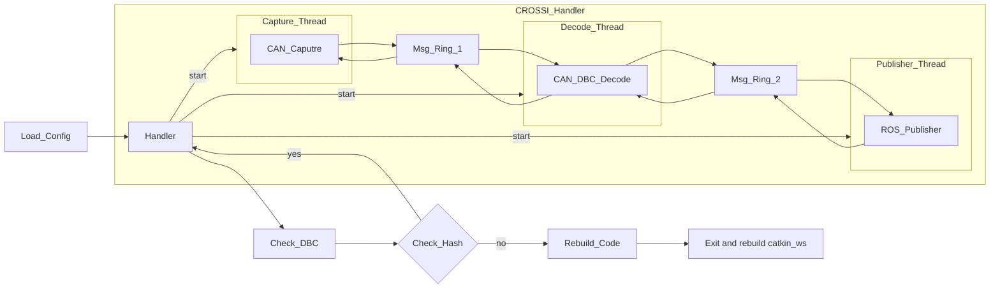

```mermaid
graph LR;

Load_Config --> Handler
Check_DBC --> Check_Hash{Check_Hash}
Check_Hash -- yes --> Handler
Check_Hash -- no --> Rebuild_Code
Handler --> Check_DBC
Rebuild_Code --> Exit[Exit and rebuild catkin_ws]

Handler -- start --> Capture_Thread
Handler -- start --> Decode_Thread
Handler -- start --> Publisher_Thread


subgraph CROSSI_Handler

    

    subgraph Capture_Thread

        CAN_Caputre

    end

    CAN_Caputre --> Msg_Ring_1
    Msg_Ring_1 --> CAN_Caputre
    
    CAN_DBC_Decode --> Msg_Ring_1
    Msg_Ring_1 --> CAN_DBC_Decode

    subgraph Decode_Thread

        CAN_DBC_Decode

    end

    CAN_DBC_Decode --> Msg_Ring_2
    Msg_Ring_2 --> CAN_DBC_Decode

    ROS_Publisher --> Msg_Ring_2
    Msg_Ring_2 --> ROS_Publisher

    subgraph Publisher_Thread

        ROS_Publisher

    end

    Handler

end

```