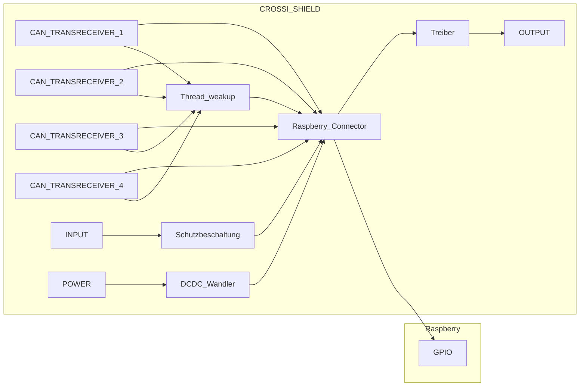

```mermaid
graph LR;

subgraph Raspberry

    GPIO

end

subgraph CROSSI_SHIELD


    CAN_TRANSRECEIVER_1 --> Raspberry_Connector
    CAN_TRANSRECEIVER_2 --> Raspberry_Connector
    CAN_TRANSRECEIVER_3 --> Raspberry_Connector
    CAN_TRANSRECEIVER_4 --> Raspberry_Connector

    CAN_TRANSRECEIVER_1 --> Thread_weakup
    CAN_TRANSRECEIVER_2 --> Thread_weakup
    CAN_TRANSRECEIVER_3 --> Thread_weakup
    CAN_TRANSRECEIVER_4 --> Thread_weakup
    Thread_weakup --> Raspberry_Connector

    Raspberry_Connector --> Treiber
    Treiber --> OUTPUT

    INPUT --> Schutzbeschaltung
    Schutzbeschaltung --> Raspberry_Connector
    
    POWER --> DCDC_Wandler
    DCDC_Wandler --> Raspberry_Connector
 
end


Raspberry_Connector --> GPIO


```