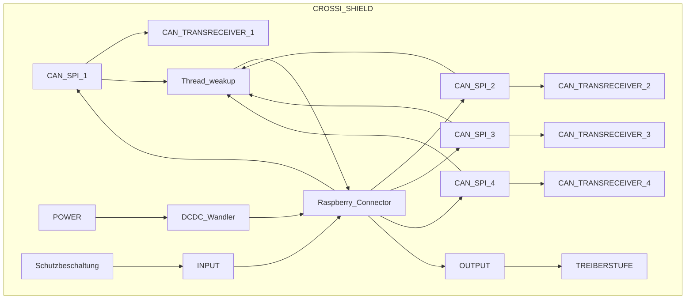

```mermaid
graph TD;

subgraph CROSSI_SHIELD
    CAN_SPI_1 --> CAN_TRANSRECEIVER_1
    CAN_SPI_2 --> CAN_TRANSRECEIVER_2
    CAN_SPI_3 --> CAN_TRANSRECEIVER_3
    CAN_SPI_4 --> CAN_TRANSRECEIVER_4

    Raspberry_Connector --> CAN_SPI_1
    Raspberry_Connector --> CAN_SPI_2
    Raspberry_Connector --> CAN_SPI_3
    Raspberry_Connector --> CAN_SPI_4
    Raspberry_Connector --> OUTPUT
    INPUT --> Raspberry_Connector

    POWER --> DCDC_Wandler
    DCDC_Wandler --> Raspberry_Connector

    Schutzbeschaltung --> INPUT
    OUTPUT --> TREIBERSTUFE

    Thread_weakup --> Raspberry_Connector

    CAN_SPI_1 --> Thread_weakup
    CAN_SPI_2 --> Thread_weakup
    CAN_SPI_3 --> Thread_weakup
    CAN_SPI_4 --> Thread_weakup

    
end


```