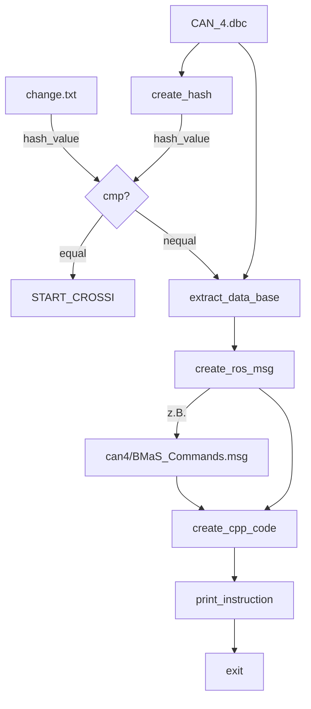

```mermaid

graph TD;

    CAN_4.dbc --> create_hash
    change.txt -- hash_value--> cmp_hash{Mode?}
    create_hash -- hash_value --> cmp_hash{cmp?}
    cmp_hash -- equal --> START_CROSSI
    cmp_hash -- nequal --> extract_data_base
    CAN_4.dbc --> extract_data_base
    extract_data_base --> create_ros_msg
    create_ros_msg -- z.B. --> can4/BMaS_Commands.msg
    can4/BMaS_Commands.msg --> create_cpp_code
    create_cpp_code --> print_instruction
    create_ros_msg --> create_cpp_code
    print_instruction --> exit

    

    


```