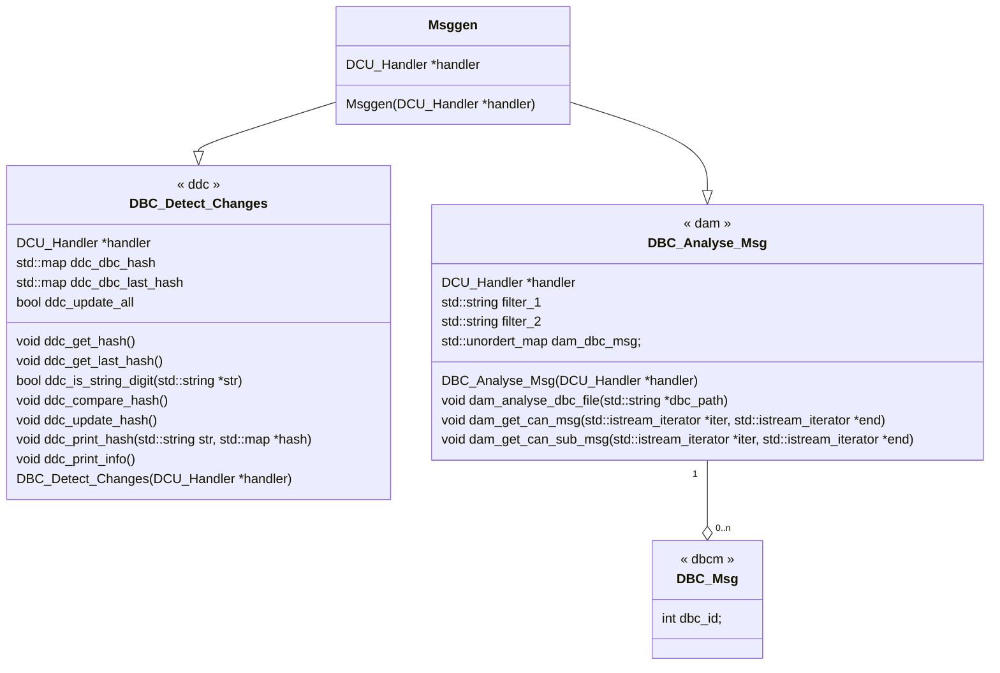

```mermaid

classDiagram

  class Msggen {
    DCU_Handler *handler
    
    Msggen(DCU_Handler *handler)
  }

  class DBC_Detect_Changes {
    << ddc >>

    DCU_Handler *handler
    std::map<int, std::size_t> ddc_dbc_hash
    std::map<int, std::size_t> ddc_dbc_last_hash
    bool ddc_update_all

    void ddc_get_hash()
    void ddc_get_last_hash()
    bool ddc_is_string_digit(std::string *str)
    void ddc_compare_hash()
    void ddc_update_hash()
    void ddc_print_hash(std::string str, std::map<int, std::size_t> *hash)
    void ddc_print_info()

    DBC_Detect_Changes(DCU_Handler *handler)
  }

  class DBC_Analyse_Msg {
    << dam >>

    DCU_Handler *handler
    std::string filter_1
    std::string filter_2
    std::unordert_map<int id, DBC_Msg*> dam_dbc_msg;


    DBC_Analyse_Msg(DCU_Handler *handler)
    void dam_analyse_dbc_file(std::string *dbc_path)
    void dam_get_can_msg(std::istream_iterator<std::string> *iter, std::istream_iterator<std::string> *end)
    void dam_get_can_sub_msg(std::istream_iterator<std::string> *iter, std::istream_iterator<std::string> *end)
  }

  class DBC_Msg{
    << dbcm >>

    int dbc_id;
    
  }


  Msggen --|> DBC_Detect_Changes
  Msggen --|> DBC_Analyse_Msg

  DBC_Analyse_Msg "1" --o "0..n" DBC_Msg

```