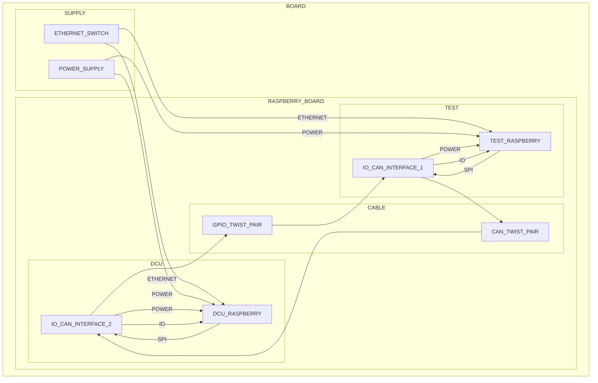

```mermaid
graph TD;

subgraph BOARD

    subgraph SUPPLY
        ETHERNET_SWITCH
        POWER_SUPPLY
    end

    subgraph RASPBERRY_BOARD
        subgraph TEST
            TEST_RASPBERRY -- SPI --> IO_CAN_INTERFACE_1;
        end

        subgraph CABLE
            CAN_TWIST_PAIR
            GPIO_TWIST_PAIR
        end

        IO_CAN_INTERFACE_1 --> CAN_TWIST_PAIR;
        IO_CAN_INTERFACE_2 --> GPIO_TWIST_PAIR;

        CAN_TWIST_PAIR --> IO_CAN_INTERFACE_2;
        GPIO_TWIST_PAIR --> IO_CAN_INTERFACE_1;

        subgraph DCU
            DCU_RASPBERRY -- SPI --> IO_CAN_INTERFACE_2;
        end


    end


end


    

ETHERNET_SWITCH -- ETHERNET --> TEST_RASPBERRY;
ETHERNET_SWITCH -- ETHERNET --> DCU_RASPBERRY;

POWER_SUPPLY -- POWER --> TEST_RASPBERRY;
POWER_SUPPLY -- POWER --> DCU_RASPBERRY;

IO_CAN_INTERFACE_1 -- POWER --> TEST_RASPBERRY;
IO_CAN_INTERFACE_2 -- POWER --> DCU_RASPBERRY;

IO_CAN_INTERFACE_1 -- IO --> TEST_RASPBERRY;
IO_CAN_INTERFACE_2 -- IO --> DCU_RASPBERRY;


    
```